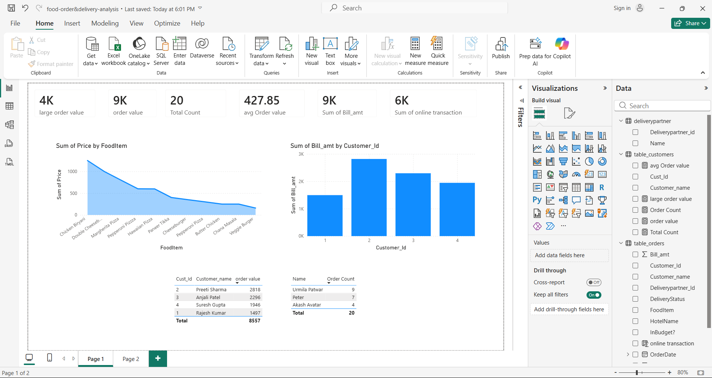
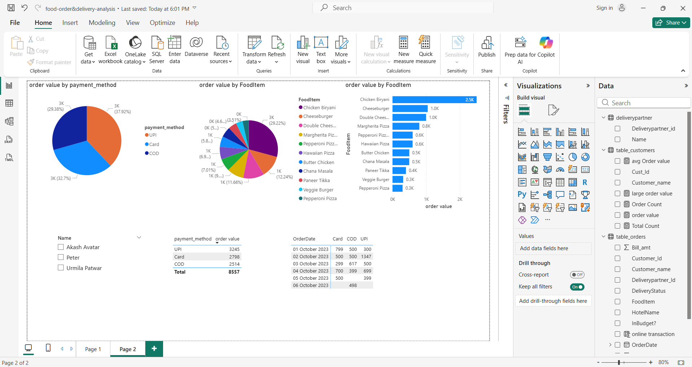

# Food Order & Delivery Analysis 🍔📊

## Project Overview
This project features a comprehensive Power BI dashboard designed to analyze food ordering trends, customer purchasing behaviors, and delivery metrics. By transforming raw data into interactive visualizations, this analysis provides actionable insights into revenue generation and payment preferences within a food delivery ecosystem (inspired by platforms like Zomato).

### Revenue & Order Metrics Dashboard

### Customer & Payment Trends Dashboard

## 🎯 Key Insights 
The dashboard is split into distinct report pages, highlighting the following metrics:

**1. Revenue & Order Metrics**
* Evaluated a total order value of 9K across 20 distinct orders.
* Tracked an average order value (AOV) of 427.85 per transaction.
* Identified **Chicken Biryani** as the highest-revenue generating food item (2.5K), followed by Double Cheeseburger and Margherita Pizza.
* Mapped order distribution across specific delivery partners (e.g., Urmila Patwar, Peter, Akash Avatar) to monitor logistics efficiency.

**2. Customer & Payment Trends**
* **UPI** stands out as the dominant payment method, capturing 3,245 of the total order value (~37.9%), followed by Card (2,798) and Cash on Delivery (2,514).
* Monitored daily transaction volumes over the first week of October 2023, showcasing a balanced adoption of digital vs. cash payments.
* Profiled top customers by transaction volume and overall bill amount to understand user retention and high-value orders.

## 🛠️ Tools & Technologies
* **Power BI:** Used for data cleaning, modeling, DAX measure creation, and building the interactive visual interface.
* **Data Visualization:** Pie charts, bar graphs, area charts, and matrix tables for clear, scannable reporting.

## 📂 Repository Structure
* `zomato-analysis.pbix`: The core Power BI project file containing the data model and dashboards.
* `Dashboard-Page1.png`: Snapshot of the main revenue and customer metrics dashboard.
* `Dashboard-Page2.png`: Snapshot of the payment methods and item-specific analysis.

## 👨‍💻 Author
**Ajeet Singh**
* GitHub: [@ajeetsingh1308](https://github.com/ajeetsingh1308)

